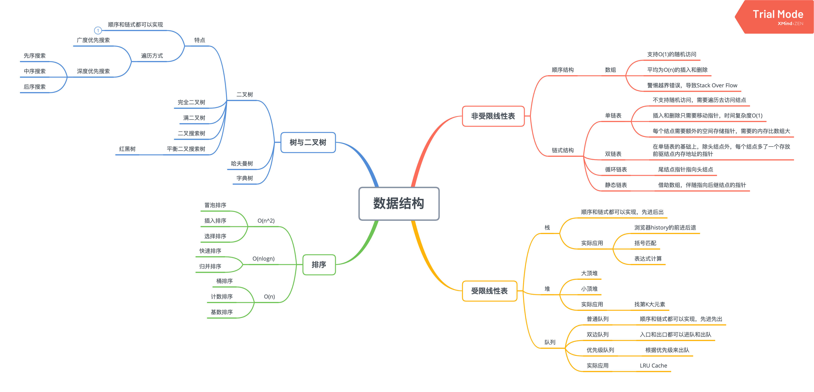

### 数据结构算法练习

- 数据结构思维导图


- 算法导图


- 工具
  *   [Windows Microsoft New Terminal](http://github.com/microsoft/terminal)
  *   [VS Code Themes](http://vscodethemes.com/)
  *   [教你打造一款颜值逆天的 VS Code](http://toutiao.io/posts/7w5ixl/preview)
  *   [炫酷的 VS Code 毛玻璃效果](http://juejin.im/post/5ce1365151882525ff28ed47)
  *   [自顶向下的编程方式](http://markhneedham.com/blog/2008/09/15/clean-code-book-review/)
  *   [自顶向下编程的 LeetCode 例题](http://leetcode-cn.com/problems/valid-palindrome/)

- 指法、小操作
  * 行首/尾 command + left/right
  * 单词切分 option + left/right
  * 删除单词 option + delete
  * 删除行 command + delete
  * 行上/下移 option + up/down
  * 复制行 shift + option + up/down

- 自顶向下编程方式
  * 新闻稿形式，顶部标题，后面细节

- 时间空间复杂度参考
  *   [如何理解算法时间复杂度的表示法](http://www.zhihu.com/question/21387264)
  *   [Master theorem](http://en.wikipedia.org/wiki/Master_theorem_(analysis_of_algorithms))
  *   [主定理](http://zh.wikipedia.org/wiki/%E4%B8%BB%E5%AE%9A%E7%90%86)

- 常见时间复杂度`(只看最高复杂度的运算)`
  * O(1)  Constant Complexity 常数复杂度
  * O(log n)  Logarithmic Complexity 对数复杂度
  * O(n)  Linear Complexity 线性复杂度
  * O(n^2)  N square Complexity 平方
  * O(n^3)  N square Complexity 立方
  * O(2^n)  Exponential Growth  指数
  * O(n!))  Factorial 阶乘


```
O(1)
  System.out.printIn('print');

O(n)
  for (int i = 1; i <= n; i++) {
    System.out.printIn('print');
  }

O(n^2)
  for (int i = 1; i <= n; i++) {
    for (int j = 1; j <= n; j++) {
      System.out.printIn('print');
    }
  }

O(log n)
  for (int i = 1; i < n; i = i * 2) {
    System.out.printIn('print');
  }

O(k^n)
  int fib(int n) {
    if (n <= 2) return n;
    return fib(n- 1) + fib(n -2);
  }
```